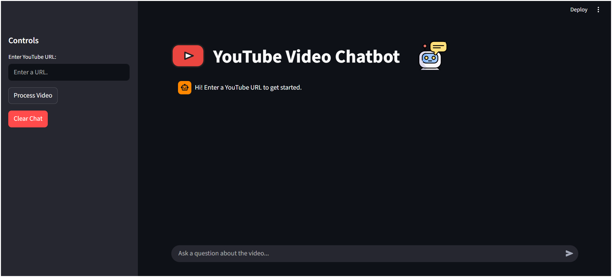

# ***YouTube Video Chatbot 🤖***


This project is a powerful chatbot that can answer your questions about any YouTube video. Just provide a URL, and the app will fetch the video's transcript, build a knowledge base, and let you chat with it in real-time.

The app is built with `Streamlit` and `LangChain`, and features a robust backend that can handle multi-language transcripts and on-the-fly translation.

<!--  -->
<p align="center">
  
</p>

## **✨ Features ✨**

- **Chat with any YouTube Video:** Provides a simple, clean chat interface to "talk" to a video.

- **Multi-language Fallback:** Automatically fetches English transcripts. If English is unavailable, it searches for any ohter available transcript.

- **On-the-Fly Translation:** If the desired transcript is found, it's translated in real-time to English before being processed.

- **Stateful Chat Interface:** Remembers your conversation using Streamlit's session state.

- **Robust Caching:** Processes a video once (fetching, chunking, and vectorizing) and lets you ask multiple questions without re-processing.

- **Clean & Simple UI:** Built with `Streamlit`, including a progress bar, "Clear Chat" functionality, and a "press-enter-to-submit" chat box.

- **Reliable Vector Store:** Uses `FAISS` for an in-memory vector store, which completely prevents the cache pollution and "imaginary answers" that can happen with other vector stores in a Streamlit environment.


## **👩‍💻 How it works (Pipeline)**
This app uses a RAG (Retrieval-Augmented Generation) pipeline, but with a crucial optimization: it does not use an agent for the data-fetching step.

1. **Transcript Fetching:** The user provides a YouTube URL. The app's backend (using `youtube-transcript-api`) intelligently fetches the best available transcript (first 'en', then 'any').

2. **On-the-Fly Translation:** If a non-English transcript is found, it's passed to `deep-translator` (using the `GoogleTranslator` engine for reliability) and translated chunk-by-chunk.

3. **Vectorization (RAG):**
    - The full English transcript is split into semantic chunks.
    - An `OpenAIEmbeddings` model converts these chunks into vectors.
    - The vectors are stored in a `FAISS` in-memory vector store, which is then cached in the Streamlit session.

4. **Question Answering:**
    - When you ask a question, the app searches the FAISS store for the most relevant chunks of text.
    - These chunks are passed (as context) along with your question to a ChatOpenAI LLM.
    - The LLM generates an answer based only on the provided context.


## **⚠️ A Note on Architecture: The 300k+ Token Mistake ⚠️**
This project was initially built using a `LangChain ReAct Agent` to orchestrate the entire process. This approach proved to be:

- **Expensive:** It consumed over 300,000 paid tokens in failed attempts.
- **Unreliable:** The agent would get confused by the transcript text, thinking it was a new instruction and looping.
- **Uncontrollable:** It was nearly impossible to force the agent to return the raw, un-summarized transcript text, which is essential for building a clean RAG pipeline.  

***The final, working solution was to delete the agent entirely.***


The current architecture uses simple, direct Python function calls (`get_video_id() -> get_transcript() -> split_transcript()`). This is ~99% cheaper, infinitely faster, and 100% reliable.


<font size=10>Key Takeaway: Don't use a complex, expensive agent for a task that can be accomplished with a simple, deterministic script.</font>


## **⚙️ Technology Stack**

- **Frontend:** `Streamlit`  
- **Backend & Orchestration:** `LangChain` (Runnables and custom functions)  
- **LLM:** `OpenAI` (via `langchain-openai`)  
- **Transcript Fetching:** `youtube-transcript-api`  
- **Translation:** `deep-translator` (`GoogleTranslator`)  
- **Vector Store:** `FAISS` (via `langchain-community`)  
- **Embeddings:** `OpenAIEmbeddings`  

## **👩‍💻 Setup & Installation**

1. **Clone the repository 🧬:**
```bash
git clone https://github.com/Anindya4/YouTube-Chatbot-using-LangChain.git
cd yt-chatbot
```

2. **Install dependencies 📩:**
```python
pip install -r requirements.txt
```

3. **Create your environment file 📂:** Create a file named `.env` in the root of the project.
 
4. **Add your API key 🔑:** Add your` OpenAI API key` to the `.env` file. Or anyother provider you like just make sure to change them into code base as required.


## **How to Run**

Open your terminal in the project's root directory.

Run the Streamlit app:
```python
streamlit run app.py
```
3. Your browser will automatically open to the app's local URL.
